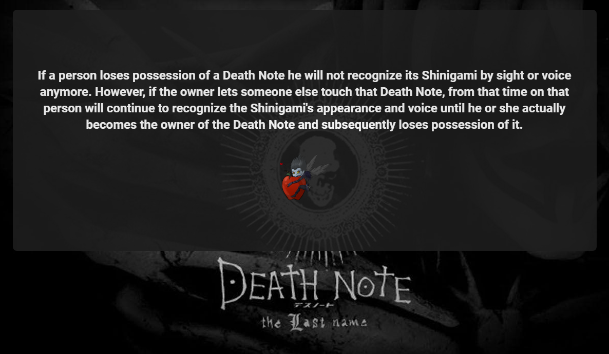
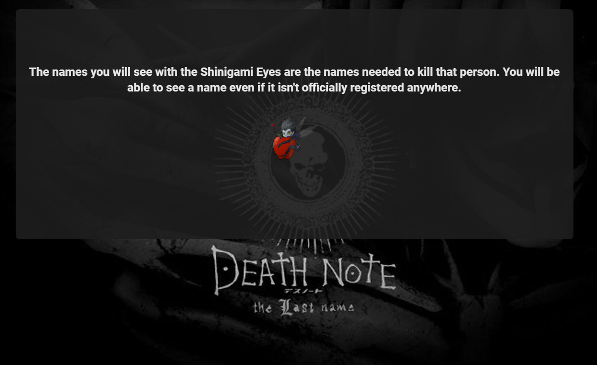

# Death Note Rules Api + Frontend

A simple API containing 91 entries about the famous anime/manga series ' Death note ' rules and informations .

This was created using :

   
 
 

 

## API Reference

#### Get all items

```http
  GET /api/rules
```

#### Get item

```http
  GET /api/rules/${id}
```

| Parameter | Type     | Description         |
| :-------- | :------- | :------------------ |
| `id`      | `int`    | Id of item to fetch |
| `rule`    | `String` | rule description    |

## Documentation

### API

The api is using the JSON-SERVER package .  
cd into the api's folder and run :

```
json-server --watch rules.json
```

to start the server locally .

### Frontend

This is a basic NUXTJS static webapp , styled using VUETIFYJS .

cd into the Frontend folder and run :

```
npm run dev
```

## Screenshots




## Authors

- [@ZTF666](https://www.github.com/ZTF666)

## License

[MIT](https://choosealicense.com/licenses/mit/)
